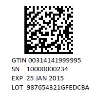

Kellerberrin Software
=====================    

.. toctree::
    :maxdepth: 2
    :glob:
    :hidden:
    :includehidden:
    
    contact/contact
    counterfeit/counterfeit

.. image:: tree_wheat_large.jpg
    :width: 678px
    :height: 371px
    :align: center

|
|
 
Kellerberrin software is a technical software developer. We are interested
in mathematical software, particularly the applied use of cryptographic techniques for
authentication.

Our delivery platforms are the Web (Javascript, AngularJS, Css3, Sass, HTML5), Android (Java) and
Google App Engine (Python). We also have considerable experience with real-time C++ in
financial markets.  

Browse our projects below and contact us for more information. 

Validated Inventory 
+++++++++++++++++++

  
:ref:`The Universal Validated Inventory System (UVIS)<counterfeit>` is an innovative *Trace and Trace* system
that uses smart phones and cloud based computing to implement a light-weight secure 
distribution channel.

|
|
|
|
|
|
|
|

United States Drug Database. 
++++++++++++++++++++++++++++

`Find equivalent US drugs (http://pharmcat.com). <http://pharmcat.com>`_ An on-line version of the US Food and Drug
Administration (FDA) drug database. Users
can search the database by National Drug Code (NDC), Drug Name and Active Ingredients. This database is also used by the
pharmaceutical authentication software developed by Kellerberrin.

|
|
|
|
|

.. image:: padlock.png
    :width: 50px
    :height: 50px
    :align: left
     
:ref:`Restricted Content<softwaredoc>`

  
